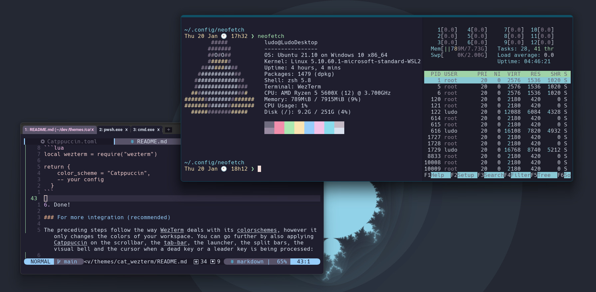

<h3 align="center">
	<br/>
	
	Catppuccin for WezTerm
	
</h3>

<p align="center">
    <a href="https://github.com/catppuccin/template/stargazers"></a>
    <a href="https://github.com/catppuccin/template/issues"></a>
    <a href="https://github.com/catppuccin/template/contributors"></a>
</p>

<p align="center">
  
</p>

## Usage

1. Clone this repository locally
1. If you're on a POSIX system: create a directory named `~/.config/wezterm/colors`, if you're on Windows, create a directory named `colors` in the same directory as the `wezterm.exe` (usually `C:\Program Files\WezTerm`).
1. Move the file `Catppuccin.toml` from where you cloned Catppuccin to the `colors` directory you created in 2.
1. Open your WezTerm config file (on a POSIX system: `~/.wezterm.lua` or `~/.config/wezterm/wezterm.lua`; on Windows: `wezterm.lua` in the same directory as the `wezterm.exe`).
   The WezTerm config file has the following structure:

```lua
local wezterm = require("wezterm")
return {
    -- your config
    -- ...
}
```

5. Just add these lines:

```lua
local wezterm = require("wezterm")
local catppuccin = require("colors/catppuccin")

return {
    -- one of the flavours: latte | frappe | macchiato | mocha
    colors = catppuccin("mocha"),
    -- your config
    -- ...
}
```

6. Done!

### For more integration (recommended)

To change to a different flavour when WezTerm detects that your system-wide colorscheme has changed:

1. Open the file `wezterm.lua` where you cloned Catpuccin and copy its content.
1. Paste it in your WezTerm config file:

```lua
local wezterm = require("wezterm")
local catppuccin = require("colors/catppuccin")

function scheme_for_appearance(appearance)
    if appearance:find("Dark") then
        -- the appearance for dark mode
        return catppuccin("mocha")
    else
        -- the appearance for light mode
        return catppuccin("latte")
    end
end

wezterm.on("window-config-reloaded", function(window, pane)
    local overrides = window:get_config_overrides() or {}
    local appearance = window:get_appearance()
    local scheme = scheme_for_appearance(appearance)
    if overrides.background ~= scheme.background then
        overrides.colors = scheme
        window:set_config_overrides(overrides)
    end
end)

return {
    -- one of the flavours: latte | frappe | macchiato | mocha
    colors = catppuccin("mocha"),
    -- your config
    -- ...
  }
```

3. Enjoy!

## 💝 Thanks to

-   [Pocco81](https://github.com/Pocco81)
-   [LudoPinelli](https://github.com/LudoPinelli)

&nbsp;

<p align="center"></p>
<p align="center">Copyright &copy; 2020-present <a href="https://github.com/catppuccin" target="_blank">Catppuccin Org</a>
<p align="center"><a href="https://github.com/catppuccin/catppuccin/blob/main/LICENSE"></a></p>
