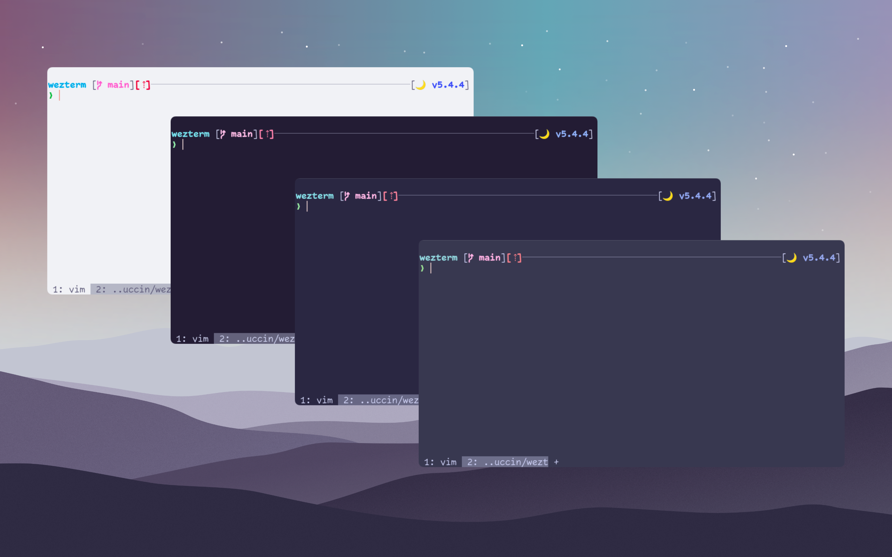

<h3 align="center">
	<br/>
	
	Catppuccin for <a href="https://github.com/wez/wezterm">WezTerm</a>
	
</h3>

<p align="center">
	<a href="https://github.com/catppuccin/wezterm/stargazers"></a>
	<a href="https://github.com/catppuccin/wezterm/issues"></a>
	<a href="https://github.com/catppuccin/wezterm/contributors"></a>
</p>

<p align="center">
  
</p>

## Usage

1. Clone this repository locally, or download [catppuccin.lua](https://raw.githubusercontent.com/catppuccin/wezterm/main/catppuccin.lua) directly.
2. If you're on a POSIX system: create a directory named `~/.config/wezterm/colors`, if you're on Windows, create a directory named `colors` in the same directory as the `wezterm.exe` (usually `C:\Program Files\WezTerm`).
3. Move `catppuccin.lua` to the `colors` directory you created in step 2.
4. Open your WezTerm config file (on a POSIX system: `~/.wezterm.lua` or `~/.config/wezterm/wezterm.lua`; on Windows: `wezterm.lua` in the same directory as the `wezterm.exe`).
   The WezTerm config file has the following structure:

```lua
local wezterm = require("wezterm")

return {
	-- your config
	-- ...
}
```

5. Add these lines:

```lua
local wezterm = require("wezterm")
local catppuccin = require("colors/catppuccin").setup {}

return {
	-- your config
	-- ...
	colors = catppuccin,
}
```

6. (Optional) Tweak the config to your liking, these are the default values:
```lua
local catppuccin = require("colors/catppuccin").setup {
	-- whether or not to sync with the system's theme
	sync = true,
	-- the flavours to switch between when syncing
	-- available flavours: "latte" | "frappe" | "macchiato" | "mocha"
	sync_flavours = {
		light = "latte",
		dark = "mocha"
	},
	-- the default/fallback flavour, when syncing is disabled
	flavour = "mocha"
}
```

7. Enjoy!

## 💝 Thanks to

-	[Pocco81](https://github.com/Pocco81)
-	[LudoPinelli](https://github.com/LudoPinelli)
-	[winston](https://github.com/nekowinston)

&nbsp;

<p align="center"></p>
<p align="center">Copyright &copy; 2021-present <a href="https://github.com/catppuccin" target="_blank">Catppuccin Org</a>
<p align="center"><a href="https://github.com/catppuccin/catppuccin/blob/main/LICENSE"></a></p>
